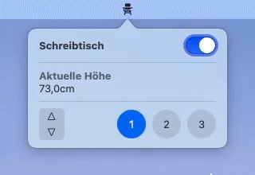
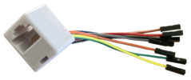
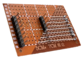

# Desk Client

This application can be used to control a Deskfit DF300 (a height-adjustable desk) from macOS.
An Arduino is used as a bridge between macOS and the motor control box by sending the same commands
as the included control panel would.

## Reverse Engineering

As there is no public documentation about how the communication between motor driver and control panel is implemented
(I could only see that it uses an RJ45 cable for connection),
I bought a [RJ45 coupling](https://amzn.eu/d/dprkV7z), divided it in the middle,
replaced the internal wires with jumper cables and connected everything back on a small self-soldered PCB board,
where I added additional pins to listen to the individual signals of the RJ45 cable.

By measuring voltages and listening on the serial lines using a
[USB to Serial adapter](https://amzn.eu/d/0RCaK8B) and [CoolTerm](http://freeware.the-meiers.org/),
I figured out the meaning of the 8 wires of the RJ45 cable from the perspective of the control panel:

<!---
| Pin | Function            |
|-----|---------------------|
| 1   | +5V                 |
| 2   | GND                 |
| 3   | TX                  |
| 4   | RX                  |
| 5   | BTN: 1 or 3         |
| 6   | BTN: UP or 2        |
| 7   | BTN: DOWN or 2 or 3 |
| 8   | BTN: M              |
-->

| Pin          | 1   | 2   | 3   | 4   | 5      | 6       | 7              | 8   |
|--------------|-----|-----|-----|-----|--------|---------|----------------|-----|
| **Function** | +5V | GND | TX  | RX  | 1 or 3 | UP or 2 | DOWN or 2 or 3 | M   |

The serial TX and RX lines work using 8 data bits, no parity bit and 1 stop bit.

Pins 5 to 8 describe LOW-active buttons states, e.g. they are LOW if one of the respective buttons is pressed.

### Data to Motor Controller

A message to the motors seems to consist of 1 byte.

| Data | Meaning                    | Send Interval        | Returns                              |
|------|----------------------------|----------------------|--------------------------------------|
| 0    | _Unknown_                  | 3 times between 0x11 | _Nothing_                            |
| 0x11 | Request height information | continuously         | Height value if changed, else 0x5555 |
| 0x77 | Init                       | once on power on     | Height value                         |

### Data from Motor Controller

A message to the control panel consists of 3 packets (= 3 bytes): 2 bytes for the actual data and one byte,
which is the sum of the 2 data bytes
(e.g. 10 would be sent as `0x00 0x0a 0x0a`; 0x5555 would be sent as `0x55 0x55 0xAA`).

| Data       | Meaning                                                        | Display Result      |
|------------|----------------------------------------------------------------|---------------------|
| 1 - 5      | Error 1 - 5                                                    | Er1 - Er5           |
| 9          | Motor overheated                                               | Hot                 |
| 10         | Assign current height to slot (expects pressing of 1, 2, or 3) | S--                 |
| 11         | "Assign current height to slot" timed out (nothing pressed)    | _last height value_ |
| 12 - 14    | Current height was successfully assigned to slot 1, 2, or 3    | S-1 / S-2 / S-3     |
| 400 - 2000 | Height value in mm                                             | 40.0 - 200          |
| 0x1111     | Sleep                                                          | ---                 |
| 0x5555     | Wakeup / Idle                                                  | _last height value_ |
